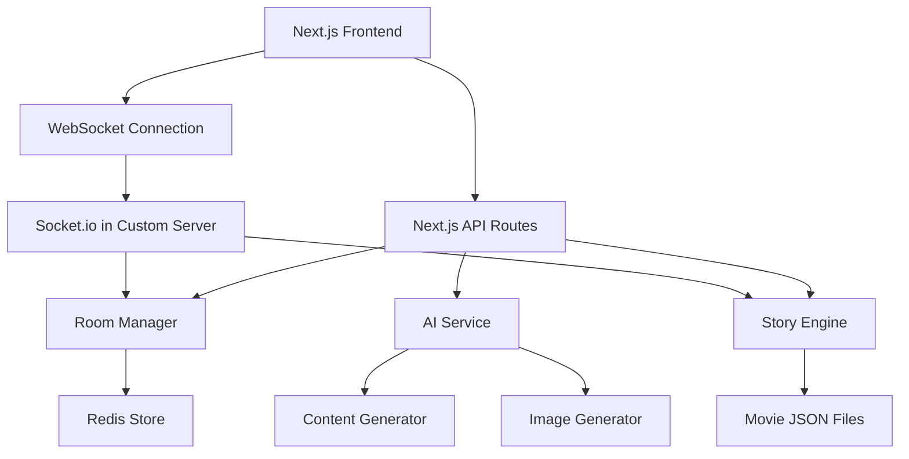

# Design Document

## Overview

The Multiplayer Cinema Storytelling Game is a real-time web application built with Next.js that enables collaborative interactive storytelling experiences. The system leverages WebSocket connections for real-time synchronization, AI services for dynamic content generation, and a modular architecture to support both single-player and multiplayer game modes.

The application follows a client-server architecture where the Next.js frontend handles user interactions and real-time updates, while the backend manages game state, AI integration, and room coordination through Socket.io.

## Architecture

### High-Level Architecture



### Technology Stack

- **Frontend & Backend**: Next.js 15.5.0 (fullstack) with React 19.1.0
- **Styling**: Tailwind CSS 4.0
- **Real-time Communication**: Socket.io integrated within Next.js custom server
- **AI Integration**: Gemini API for story generation, OpenAI API (DALL-E for images)
- **State Management**: React Context for client state
- **Data Storage**: Redis for game sessions and room management, JSON files for movie data
- **Language**: JavaScript (ES6+)
- **Deployment**: Custom Next.js server deployment (Railway/Render) for Socket.io support

### Deployment Architecture

The application uses Next.js as a fullstack solution with custom server:
- Next.js custom server integrating both HTTP and WebSocket (Socket.io) functionality
- Single deployment containing frontend pages, API routes, and Socket.io server
- Redis for persistent game state and room management across server restarts
- Deployed as a single service (Railway/Render/DigitalOcean) that supports custom servers

## Components and Interfaces

### Core Components

#### 1. Game Room Management
```javascript
// GameRoom data structure
const gameRoom = {
  id: 'room_123',
  code: 'ABC123',
  movieId: 'harry-potter-1',
  mode: 'multiplayer', // 'single' | 'multiplayer'
  maxPlayers: 4,
  players: [
    {
      id: 'player_456',
      name: 'John',
      characterId: 'harry',
      isHost: true,
      isConnected: true,
      joinedAt: new Date()
    }
  ],
  currentTurn: 'player_456',
  storyState: {},
  createdAt: new Date(),
  isActive: true
};
```

#### 2. Story Management
```javascript
// Movie data structure
const movie = {
  id: 'harry-potter-1',
  title: 'Harry Potter and the Philosopher\'s Stone',
  description: 'A young wizard discovers his magical heritage...',
  characters: [
    {
      id: 'harry',
      name: 'Harry Potter',
      description: 'The Boy Who Lived',
      avatar: '/images/harry.jpg',
      personality: 'brave, curious, loyal'
    }
  ],
  checkpoints: [
    {
      id: 'checkpoint-1',
      position: 1,
      context: 'Harry receives his Hogwarts letter',
      characterChoices: {
        'harry': [
          {
            id: 'choice-1a',
            text: 'Read the letter immediately',
            impact: 'eager acceptance',
            consequences: ['excitement', 'curiosity']
          }
        ]
      }
    }
  ],
  baseScript: 'Original movie script content...'
};
```

#### 3. Story State
```javascript
// Story state data structure
const storyState = {
  currentCheckpoint: 1,
  completedChoices: [
    {
      checkpointId: 'checkpoint-1',
      playerId: 'player_456',
      characterId: 'harry',
      choiceId: 'choice-1a',
      timestamp: new Date()
    }
  ],
  generatedContent: [
    {
      id: 'content_789',
      type: 'text', // 'text' | 'image'
      content: 'Harry eagerly tore open the letter...',
      context: 'After choosing to read immediately',
      checkpointId: 'checkpoint-1',
      timestamp: new Date()
    }
  ],
  alternateScript: 'Generated alternate storyline...',
  turnCount: 1,
  isComplete: false
};
```

### Frontend Components

#### 1. Page Components
- `HomePage`: Main landing page with create/join options
- `GameRoomPage`: Main game interface with story display and controls
- `CharacterSelectionPage`: Character selection interface
- `StoryCompletePage`: Final story display and sharing options

#### 2. UI Components
- `RoomCodeInput`: Input component for joining rooms
- `MovieSelector`: Grid/list of available movies
- `CharacterCard`: Individual character selection card
- `StoryDisplay`: Main story content display area
- `ChoiceButtons`: Interactive choice selection interface
- `PlayerList`: Current players and turn indicator
- `LoadingSpinner`: AI content generation loading states

#### 3. Real-time Components
- `SocketProvider`: WebSocket connection management
- `GameStateProvider`: Game state synchronization
- `TurnManager`: Turn rotation and timing logic

### Backend Services

#### 1. Room Manager Service
```javascript
// Room Manager functions
const roomManager = {
  async createRoom(movieId, mode) {
    // Creates new room in Redis and returns room object
  },
  
  async joinRoom(roomCode, player) {
    // Adds player to existing room, returns success boolean
  },
  
  async leaveRoom(roomId, playerId) {
    // Removes player from room, handles cleanup
  },
  
  async getRoomByCode(code) {
    // Retrieves room from Redis by code
  },
  
  async updateRoomState(roomId, stateUpdate) {
    // Updates room state in Redis
  }
};
```

#### 2. Story Engine Service
```javascript
// Story Engine functions
const storyEngine = {
  loadMovie(movieId) {
    // Loads movie data from JSON files
  },
  
  async processChoice(roomId, choice) {
    // Processes player choice and updates story state
  },
  
  async generateNextSegment(context) {
    // Uses AI to generate next story segment
  },
  
  checkStoryCompletion(storyState) {
    // Determines if story is complete
  }
};
```

#### 3. AI Content Service
```javascript
// AI Content Service functions
const aiService = {
  async generateStorySegment(prompt) {
    // Calls Gemini API to generate story text
    // prompt: { character, choice, previousContext, movieContext }
  },
  
  async selectRandomScene(movieData) {
    // Selects random scene from harryPotter.json using Gemini API
  },
  
  async generateCharacterChoices(context, character) {
    // Generates character-specific choices using Gemini API
  },
  
  async generateSceneImage(description) {
    // Calls DALL-E API to generate scene images
  },
  
  validateContent(content) {
    // Validates generated content for appropriateness
  }
};
```

## Data Models

### Movie Data Structure
Movies are stored as JSON files with the following structure:

```json
{
  "id": "harry-potter-1",
  "title": "Harry Potter and the Philosopher's Stone",
  "description": "A young wizard discovers his magical heritage...",
  "characters": [
    {
      "id": "harry",
      "name": "Harry Potter",
      "description": "The Boy Who Lived",
      "personality": "brave, curious, loyal"
    }
  ],
  "checkpoints": [
    {
      "id": "checkpoint-1",
      "position": 1,
      "context": "Harry receives his Hogwarts letter",
      "characterChoices": {
        "harry": [
          {
            "id": "choice-1a",
            "text": "Read the letter immediately",
            "impact": "eager acceptance"
          }
        ]
      }
    }
  ]
}
```

### Game Session Storage
Game sessions are stored in Redis with the following structure:

```javascript
// Redis key structure
const redisKeys = {
  rooms: 'rooms:*',           // rooms:room_123
  players: 'players:*',       // players:player_456
  roomCodes: 'codes:*',       // codes:ABC123 -> room_123
  activeGames: 'active:*'     // active:room_123 -> game state
};

// In-memory for active connections only
const activeConnections = new Map(); // socketId -> { playerId, roomId }
```

## Error Handling

### Client-Side Error Handling
1. **Connection Errors**: Automatic reconnection with exponential backoff
2. **AI Generation Failures**: Fallback content and retry mechanisms
3. **Invalid Room Codes**: Clear error messages and suggestions
4. **Character Selection Conflicts**: Real-time availability updates

### Server-Side Error Handling
1. **Room Management**: Graceful handling of disconnections and rejoins
2. **AI Service Failures**: Fallback content generation and error logging
3. **Memory Management**: Automatic cleanup of inactive rooms
4. **Rate Limiting**: Protection against API abuse

### Error Recovery Strategies
```javascript
// Error handling functions
const errorHandler = {
  handleAIFailure(context) {
    // Return fallback content based on context
    return "The story continues as expected...";
  },
  
  handleConnectionLoss(roomId, playerId) {
    // Pause game and notify other players
    // Update Redis with player disconnection
  },
  
  async handleRoomCleanup() {
    // Remove inactive rooms from Redis after timeout
  }
};
```

## Testing Strategy

### Unit Testing
- **Component Testing**: React Testing Library for UI components
- **Service Testing**: Jest for business logic and API functions
- **Utility Testing**: Pure function testing for game logic
- **AI Service Testing**: Mock Gemini and OpenAI services for consistent testing

### Integration Testing
- **API Route Testing**: Next.js API route testing
- **Socket.io Testing**: WebSocket connection and event testing
- **AI Integration Testing**: Mock AI services with realistic response times
- **Story Flow Testing**: End-to-end story generation and progression

### End-to-End Testing
- **User Flow Testing**: Playwright for complete user journeys
- **Multiplayer Testing**: Simulated multi-user scenarios
- **Real-time Testing**: WebSocket event synchronization testing
- **Story Progression Testing**: Complete story cycles with AI generation

### Performance Testing
- **Load Testing**: Multiple concurrent rooms and players
- **AI Response Testing**: Gemini API response time metrics (under 10 seconds)
- **Memory Usage Testing**: Room cleanup and memory leak detection
- **Animation Performance**: UI animation smoothness and responsiveness

### Test Structure
```
tests/
├── unit/
│   ├── components/
│   ├── services/
│   └── utils/
├── integration/
│   ├── api/
│   ├── socket/
│   └── ai/
├── e2e/
│   ├── single-player/
│   ├── multiplayer/
│   └── room-management/
└── performance/
    ├── load/
    └── stress/
```

### Testing Configuration
- **Jest**: Unit and integration testing framework
- **React Testing Library**: Component testing utilities
- **Playwright**: End-to-end testing framework
- **Socket.io Client**: WebSocket testing utilities
- **MSW (Mock Service Worker)**: API mocking for tests

The testing strategy ensures comprehensive coverage of both individual components and the complete multiplayer experience, with particular attention to real-time synchronization and AI content generation reliability.