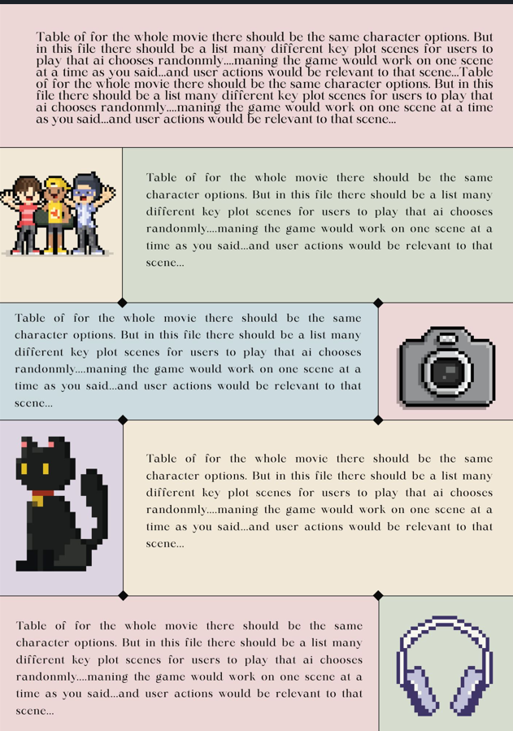
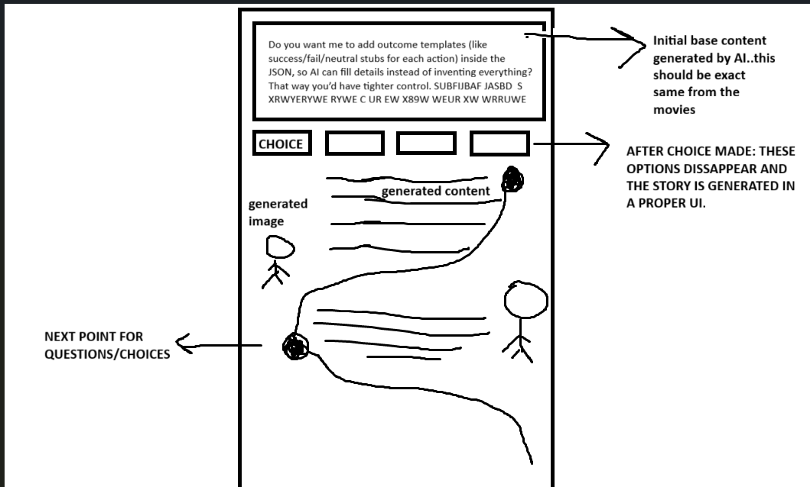
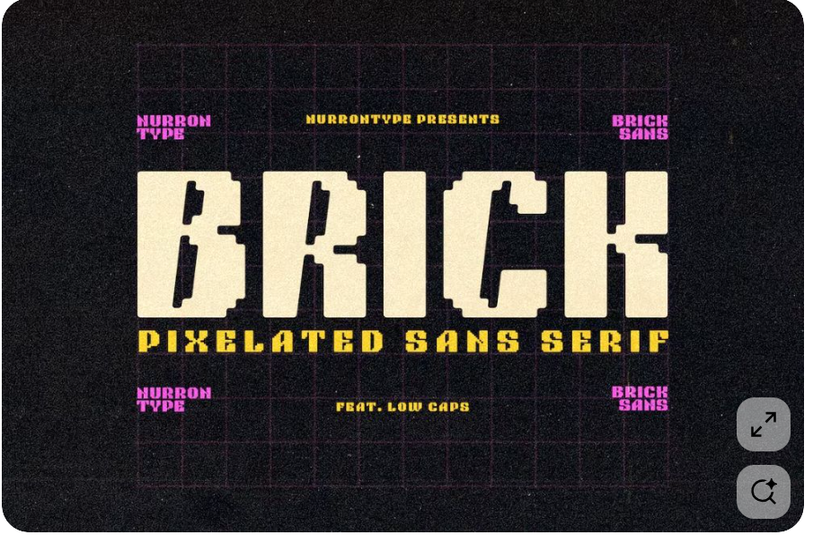

# Implementation Plan

- [x] 1. Set up project foundation and core infrastructure

  - Initialize Next.js project with custom server configuration for Socket.io integration
  - Configure Tailwind CSS, ESLint, and project structure
  - Set up environment variables for OpenAI API and Redis connection
  - _Requirements: 8.1, 8.2_

- [x] 2. Improve Quiz-Game

  - player selects "play quiz game" on home page and chooses movie to make the room about.
  - Player should be able to select a character from that movie. 
  - player should play as that character in the quiz game room and the player username in the quiz game room should be same as that character chosen.
  - other players get code for the game room and insert to join.
  - other player should also be able to select a character from that movie (only available)
  - Each character can be chosen by only one player.

- [x] 3. Improve website design and UI/UX

  - Use this theme for website: #262c34, #1b1f22, #fdf0e9, #495696
  - Improve landing page. Keep it minimal but artistic and modern.
  - Use modern artistic fonts
  - Use external resources and assets where needed for UI/UX.
  - There should only be 2 play options: quiz game and solo. No story mode.
  - The quiz game flow should remain same but as for clicking on the movie to play; we should navigate to the character selection page for that movie for playing the quiz game.

- [x] 4. Create advanced story page UI with animations in existing solo play mode

  - Build roadmap-style story progression interface with content on alternating sides
  - Implement smooth animations for content appearance and choice transitions (framer motion is already installed)
  - Create responsive layout that works on mobile and desktop devices
  - Write component tests for story page UI interactions
  - _Requirements: 11.1, 11.2, 11.3, 11.4, 11.5, 11.6, 11.7, 11.8_

- [x] 4.1 Build roadmap-style story layout

  - Create progressive story display with content alternating between left and right sides
  - Implement initial base content display that appears first
  - Design choice selection interface that integrates with story flow
  - Use sample images from /steering/Image generation art style
  - _Requirements: 11.1, 11.2, 11.4_

- [x] 4.2 Implement advanced animations and transitions

  - Add smooth content appearance animations inspired by /steering/advanceAnimationExample.md
  - Create choice disappearance animations after selection
  - Implement visual feedback for user interactions and loading states
  - _Requirements: 11.5, 11.6, 11.7, 11.8_

- [x] 4.3 Improve UI

  - Content layout should be inpired from these 2:  and 
  - Content text boxes should not have images, instead the images should be opposite to the content
  - The content should be proper paragraghs and should not look like sqaured boxes
  - Do not assume images names for visual images, use images from /steering/Image generation art style/
  - The page colors may be changed. This type of theme might be used  where the background is a bit black with grain effect
  - remove errors

- [x] 5. Improve Story Page

  - The UI for choices is too big, make small minimal and creatively artistic
  - Created visuals samples should be taken from this folder .kiro\steering\artStyle\
  - Improve the UI and animations and make them more artistic of this sort .
  - For pixel font, use ByteBounce.ttf from public folder.
  - Utilize pacman ghosts' asset from the public folder in a creative and fun way.

- [x] 6. Transform solo game Story Page
  - Currently the solo mode runs on sample data and weird UI, implement the test-story page there
  - The solo play mode should use AI for content generation and the UI should also be same
  - Transform the current solo page with the story game implemented in earlier tasks
  - The AI should give base content of the selected scene, then choices should be generated by AI
  - After user choice, the AI should generate next content based on that
  - For visuals, use images from steering/artStyle
  
  - _Requirements: 6, 9_

- [x] 6.1 Improvements in Story

  - Each time the choices are given, they should be relevant to the current context. The choices should be generated by the AI based on the context and should not be general
  - The choices should not be general
  - The should be given to you as a second person and not third person
  - Everytime I only see choices like this and not proper AI generated choices based on context 
  

  - [x] 7. Implement new game in a game-room style

  - Replicate the existing quiz game flow and create an additional game
  - Game flow should be: choose game -> select movie -> select character -> join room
  - Implement a new logic of quiz-game where players have to answer questions about the movie as first come first serve
  - Implement a game where the players have to click the buzzer for answering and then answer the quiz option under 2 sec
  - If a player doesn't answer in given time then the control is taken from them
  - The questions to be asked should be generated and preloaded at the time of game start and not by repeatedly calling the AI
  - Each play would have 20 questions and these questions should be generated at the start. The questions should not be too obvious and general but should be detail oriented and should require deep knowledge about the movie, characters, crew etc
  - _Requirements: 12.1, 12.2, 12.3, 12.4, 12.5, 12.6, 12.7_

- [ ] 8. Cleanup

  - The quiz-game flow, buzzer-room flow and solo flow if fine
  - Remove any additional files that are redundant and not being used anywhere
  - Remove the logic that is redundant or just for testing and doesn't affect current functionality

  
- [ ] 8. Set up Redis integration and room management
  - Improve the Choices UI, it seems too big, make it a big small improve it's UI and animation and add some artistic touch
  - Configure Redis connection and error handling
  - Implement RoomManager service with create, join, leave, and update operations
  - Create Redis key structure for rooms, players, and game states
  - Write unit tests for room management operations
  - _Requirements: 1.1, 1.2, 1.3, 1.4, 5.3_

- [ ] 8. Implement AI image generation services
  - Create image generation service using DALL-E API for scene visuals
  - Implement pixel art style generation following /steering/ art style guidelines
  - Add image validation and fallback mechanisms for generation failures
  - Write unit tests with mocked AI image services
  - _Requirements: 9.1, 9.2, 9.3, 9.4, 9.5, 9.6, 9.7_

- [ ] 9. Build story engine and game logic
  - Implement StoryEngine service for processing choices and managing story flow
  - Create turn rotation logic for multiplayer mode
  - Implement story completion detection and alternate script generation
  - Write unit tests for story processing and turn management
  - _Requirements: 3.1, 3.2, 3.3, 3.4, 3.5, 4.2, 4.3, 4.4_

- [ ] 10. Create main page and room creation interface
  - Build HomePage component with create/join room options
  - Implement MovieSelector component for movie selection
  - Create room creation API route with mode selection (single/multiplayer)
  - Write component tests for main page interactions
  - _Requirements: 1.1, 4.1, 7.1_

- [ ] 11. Implement room joining functionality
  - Create RoomCodeInput component for entering room codes
  - Build room joining API route with validation
  - Implement error handling for invalid codes and full rooms
  - Write integration tests for room joining flow
  - _Requirements: 1.3, 1.4, 7.1_

- [ ] 12. Build character selection interface
  - Create CharacterSelectionPage component
  - Implement CharacterCard components with real-time availability updates
  - Build character assignment API routes
  - Write component tests for character selection interactions
  - _Requirements: 2.1, 2.2, 2.3, 2.4, 2.5_

- [ ] 13. Create main game room interface
  - Build GameRoomPage component with story display area
  - Implement StoryDisplay component for generated content
  - Create PlayerList component showing current players and turn indicator
  - Write component tests for game room UI elements
  - _Requirements: 7.2, 5.2_

- [ ] 14. Implement choice selection and story progression
  - Create ChoiceButtons component for interactive choice selection
  - Build choice processing API routes
  - Implement real-time story updates via WebSocket
  - Write integration tests for choice processing and story updates
  - _Requirements: 3.1, 3.2, 3.3, 5.1_

- [ ] 15. Add AI content generation integration
  - Integrate Gemini and image generation services with story progression system
  - Implement loading states for content generation
  - Add visual content display for generated images
  - Write integration tests for AI content generation flow
  - _Requirements: 10.1, 10.2, 10.3, 10.4, 9.1, 9.2_

- [ ] 16. Implement real-time multiplayer synchronization
  - Create SocketProvider for WebSocket connection management
  - Implement GameStateProvider for real-time state synchronization
  - Add player join/leave notifications
  - Write end-to-end tests for multiplayer synchronization
  - _Requirements: 5.1, 5.2, 5.3, 5.4_

- [ ] 17. Build story completion and sharing features
  - Create StoryCompletePage component for final story display
  - Implement story saving and sharing functionality
  - Add options to restart or create new rooms
  - Write component tests for story completion interface
  - _Requirements: 4.4, 7.5_

- [ ] 18. Add comprehensive error handling and fallbacks
  - Implement client-side error handling with reconnection logic
  - Add server-side error handling for AI failures and disconnections
  - Create fallback content for AI generation failures
  - Write error handling tests and recovery scenarios
  - _Requirements: 10.7, 9.7, 8.5_

- [ ] 19. Implement performance optimizations and cleanup
  - Add automatic room cleanup for inactive sessions
  - Implement memory management for active connections
  - Add rate limiting for API endpoints
  - Write performance tests for concurrent gameplay
  - _Requirements: 8.3, 8.4_

- [ ] 18. Create comprehensive test suite
  - Write end-to-end tests for complete user journeys (single and multiplayer)
  - Implement load testing for multiple concurrent rooms
  - Add integration tests for AI service reliability
  - Create automated test pipeline for continuous integration
  - _Requirements: All requirements validation_