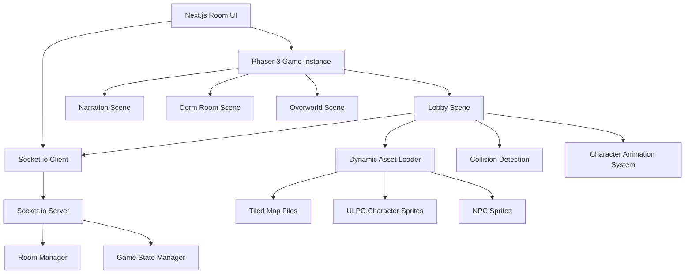

# Design Document

## Overview

The Phaser 3 Multiplayer Lobby system transforms the existing Next.js multiplayer room interface into an interactive 2D game experience. The design integrates Phaser 3 game engine with the current Socket.io infrastructure to create real-time multiplayer character movement in a shared lobby space. The system maintains the existing room management while replacing the static right-side panel with a dynamic game canvas that supports character movement, collision detection, and synchronized multiplayer interactions.

The architecture follows a hybrid approach where Next.js handles UI state management and room coordination while Phaser 3 manages the game world, character animations, and real-time movement synchronization.

## Architecture

### High-Level Architecture



### Technology Integration

- **Frontend**: Next.js 14+ with React 18+ for UI management
- **Game Engine**: Phaser 3.80+ for 2D game rendering and physics
- **Real-time Communication**: Socket.io for multiplayer synchronization
- **Map System**: Tiled map editor (.tmj format) for Harry Potter world level design
- **Asset Management**: Dynamic loading system for Harry Potter character sprites (ULPC format)
- **Physics**: Phaser Arcade Physics for collision detection
- **Animation**: Custom animation system for Harry Potter character sprites
- **World Theme**: Harry Potter wizarding world with Hogwarts-themed maps and characters

### Scene Architecture

The game follows a scene-based architecture with four main Harry Potter themed scenes:

1. **Lobby Scene**: Hogwarts common room or entrance hall for multiplayer gathering
2. **Narration Scene**: Full-screen story presentation about missing professors
3. **Dorm Room Scene**: Hogwarts dormitory starting location after narration
4. **Overworld Scene**: Hogwarts grounds with Library, Potions classroom, and Courtyard areas

## Components and Interfaces

### Core Game Components

#### 1. Phaser Game Instance
```javascript
// Game configuration
const gameConfig = {
  type: Phaser.AUTO,
  width: 800,
  height: 600,
  parent: 'phaser-container',
  physics: {
    default: 'arcade',
    arcade: {
      gravity: { y: 0 },
      debug: false
    }
  },
  scene: [LobbyScene, NarrationScene, DormScene, OverworldScene]
};

// Game initialization
class GameManager {
  constructor(roomData) {
    this.roomId = roomData.roomId;
    this.world = roomData.world;
    this.charId = roomData.charId;
    this.socket = roomData.socket;
    this.game = new Phaser.Game(gameConfig);
  }
}
```

#### 2. Lobby Scene Structure
```javascript
class LobbyScene extends Phaser.Scene {
  constructor() {
    super({ key: 'LobbyScene' });
    this.players = new Map();
    this.localPlayer = null;
    this.spawnPoints = [];
    this.collisionBodies = [];
  }

  preload() {
    // Load Tiled map and character assets
    this.loadTiledMap();
    this.loadCharacterAssets();
  }

  create() {
    // Initialize map, collision, and spawn systems
    this.createMap();
    this.createCollisionBodies();
    this.createSpawnPoints();
    this.setupSocketListeners();
  }

  update() {
    // Handle input and movement
    this.handlePlayerInput();
    this.updateAnimations();
  }
}
```

#### 3. Character System
```javascript
// Character data structure
const characterData = {
  id: 'player_123',
  charId: 'female_wizard_1',
  x: 400,
  y: 300,
  action: 'idle',
  direction: 'down',
  isLocal: true,
  sprite: null,
  animations: new Map()
};

// Character management
class CharacterManager {
  constructor(scene) {
    this.scene = scene;
    this.characters = new Map();
  }

  async loadCharacterAssets(charId) {
    const actions = await this.discoverActions(charId);
    for (const action of actions) {
      await this.loadActionSprite(charId, action);
      this.createAnimations(charId, action);
    }
  }

  createCharacter(playerData) {
    const sprite = this.scene.physics.add.sprite(playerData.x, playerData.y, `${playerData.charId}_idle`);
    sprite.setCollideWorldBounds(true);
    return sprite;
  }
}
```

### Asset Loading System

#### 1. Dynamic Asset Discovery
```javascript
class AssetLoader {
  constructor(scene) {
    this.scene = scene;
    this.world = 'wizarding'; // Harry Potter wizarding world
  }

  async discoverCharacterActions(charId) {
    // Dynamically discover available Harry Potter character action PNGs
    const basePath = `/assets/wizarding/player_characters/${charId}/`;
    const harryPotterActions = ['walk', 'run', 'idle', 'spellcast', 'combat_idle', 'hurt', 'emote'];
    const availableActions = [];

    for (const action of harryPotterActions) {
      try {
        const response = await fetch(`${basePath}${action}.png`);
        if (response.ok) {
          availableActions.push(action);
        }
      } catch (error) {
        // Action not available for this Harry Potter character, skip
      }
    }

    return availableActions;
  }

  loadHogwartsMap(mapName) {
    // Load Harry Potter themed maps (lobby, dorm, overworld)
    this.scene.load.tilemapTiledJSON(mapName, `/assets/wizarding/maps/${mapName}.tmj`);
    this.scene.load.image(`${mapName}_bg`, `/assets/wizarding/maps/${mapName}.png`);
  }

  loadHarryPotterCharacterSprite(charId, action) {
    const key = `${charId}_${action}`;
    const path = `/assets/wizarding/player_characters/${charId}/${action}.png`;
    
    // Load Harry Potter character spritesheet with ULPC format (64x64 frames)
    this.scene.load.spritesheet(key, path, {
      frameWidth: 64,
      frameHeight: 64
    });
  }
}
```

#### 2. Animation System
```javascript
class AnimationManager {
  constructor(scene) {
    this.scene = scene;
  }

  createCharacterAnimations(charId, action, frameCount) {
    const directions = ['up', 'left', 'down', 'right'];
    const framesPerDirection = frameCount / 4;

    directions.forEach((direction, dirIndex) => {
      const animKey = `${charId}:${action}-${direction}`;
      const startFrame = dirIndex * framesPerDirection;
      const endFrame = startFrame + framesPerDirection - 1;

      this.scene.anims.create({
        key: animKey,
        frames: this.scene.anims.generateFrameNumbers(`${charId}_${action}`, {
          start: startFrame,
          end: endFrame
        }),
        frameRate: 8,
        repeat: action === 'walk' || action === 'run' ? -1 : 0
      });
    });
  }

  getIdleAnimation(charId, direction) {
    // Try to use idle animation, fallback to middle frame of walk
    const idleKey = `${charId}:idle-${direction}`;
    if (this.scene.anims.exists(idleKey)) {
      return idleKey;
    }
    
    // Fallback to walk middle frame
    const walkKey = `${charId}:walk-${direction}`;
    return walkKey;
  }
}
```

### Collision System

#### 1. Tiled Map Collision Processing
```javascript
class CollisionManager {
  constructor(scene) {
    this.scene = scene;
    this.collisionBodies = [];
  }

  createCollisionBodies(tilemapData) {
    const collisionLayer = tilemapData.layers.find(layer => layer.name === 'collision');
    
    if (collisionLayer && collisionLayer.objects) {
      collisionLayer.objects.forEach(obj => {
        if (obj.properties && obj.properties.collides === true) {
          const body = this.scene.physics.add.staticGroup();
          const rect = body.create(obj.x + obj.width/2, obj.y + obj.height/2);
          rect.setSize(obj.width, obj.height);
          rect.setVisible(false); // Invisible collision body
          this.collisionBodies.push(rect);
        }
      });
    }
  }

  setupPlayerCollisions(playerSprite) {
    this.collisionBodies.forEach(body => {
      this.scene.physics.add.collider(playerSprite, body);
    });
  }
}
```

#### 2. Spawn Point Management
```javascript
class SpawnManager {
  constructor(scene) {
    this.scene = scene;
    this.spawnPoints = [];
    this.usedSpawns = new Set();
  }

  loadSpawnPoints(tilemapData) {
    const spawnLayer = tilemapData.layers.find(layer => layer.name === 'spawns');
    
    if (spawnLayer && spawnLayer.objects) {
      this.spawnPoints = spawnLayer.objects
        .filter(obj => obj.name === 'spawn')
        .map(obj => ({ x: obj.x, y: obj.y }));
    }
  }

  getAvailableSpawn() {
    for (let i = 0; i < this.spawnPoints.length; i++) {
      if (!this.usedSpawns.has(i)) {
        this.usedSpawns.add(i);
        return this.spawnPoints[i];
      }
    }
    
    // Fallback to center if all spawns used
    return { x: 400, y: 300 };
  }

  releaseSpawn(spawnIndex) {
    this.usedSpawns.delete(spawnIndex);
  }
}
```

### Multiplayer Synchronization

#### 1. Socket Integration
```javascript
class MultiplayerManager {
  constructor(scene, socket) {
    this.scene = scene;
    this.socket = socket;
    this.players = new Map();
    this.localPlayerId = null;
  }

  setupSocketListeners() {
    this.socket.on('player-joined-lobby', (playerData) => {
      this.addRemotePlayer(playerData);
    });

    this.socket.on('player-moved', (moveData) => {
      this.updateRemotePlayer(moveData);
    });

    this.socket.on('player-left-lobby', (playerId) => {
      this.removeRemotePlayer(playerId);
    });
  }

  broadcastMovement(x, y, action, direction) {
    this.socket.emit('player-movement', {
      roomId: this.scene.roomId,
      playerId: this.localPlayerId,
      x, y, action, direction
    });
  }

  addRemotePlayer(playerData) {
    if (playerData.id !== this.localPlayerId) {
      const sprite = this.scene.characterManager.createCharacter(playerData);
      this.players.set(playerData.id, {
        sprite,
        data: playerData
      });
    }
  }
}
```

#### 2. Movement Synchronization
```javascript
class MovementManager {
  constructor(scene) {
    this.scene = scene;
    this.lastBroadcast = 0;
    this.broadcastThrottle = 50; // 20 FPS broadcast rate
  }

  handleInput() {
    const cursors = this.scene.input.keyboard.createCursorKeys();
    const wasd = this.scene.input.keyboard.addKeys('W,S,A,D');
    
    let velocity = { x: 0, y: 0 };
    let direction = this.scene.localPlayer.direction;
    let action = 'idle';

    if (cursors.left.isDown || wasd.A.isDown) {
      velocity.x = -160;
      direction = 'left';
      action = 'walk';
    } else if (cursors.right.isDown || wasd.D.isDown) {
      velocity.x = 160;
      direction = 'right';
      action = 'walk';
    }

    if (cursors.up.isDown || wasd.W.isDown) {
      velocity.y = -160;
      direction = 'up';
      action = 'walk';
    } else if (cursors.down.isDown || wasd.S.isDown) {
      velocity.y = 160;
      direction = 'down';
      action = 'walk';
    }

    this.updateLocalPlayer(velocity, action, direction);
  }

  updateLocalPlayer(velocity, action, direction) {
    const player = this.scene.localPlayer;
    player.sprite.setVelocity(velocity.x, velocity.y);
    
    // Update animation
    const animKey = `${player.charId}:${action}-${direction}`;
    if (this.scene.anims.exists(animKey)) {
      player.sprite.play(animKey, true);
    }

    // Throttled broadcast
    const now = Date.now();
    if (now - this.lastBroadcast > this.broadcastThrottle) {
      this.scene.multiplayerManager.broadcastMovement(
        player.sprite.x, player.sprite.y, action, direction
      );
      this.lastBroadcast = now;
    }
  }
}
```

## Data Models

### Game State Structure
```javascript
// Lobby game state
const lobbyState = {
  roomId: 'room_123',
  world: 'wizarding',
  players: [
    {
      id: 'player_456',
      charId: 'female_wizard_1',
      x: 400,
      y: 300,
      action: 'idle',
      direction: 'down',
      isReady: true
    }
  ],
  mapData: {
    name: 'lobby',
    collisionBodies: [...],
    spawnPoints: [...]
  },
  gamePhase: 'lobby' // 'lobby' | 'narration' | 'dorm' | 'overworld'
};

// Harry Potter character asset structure
const harryPotterCharacterAssets = {
  charId: 'harry_potter', // or 'hermione_granger', 'ron_weasley', etc.
  world: 'wizarding',
  actions: ['walk', 'idle', 'spellcast', 'combat_idle', 'hurt', 'emote'],
  animations: new Map([
    ['harry_potter:walk-up', animationData],
    ['harry_potter:walk-down', animationData],
    ['harry_potter:spellcast-up', animationData],
    // ... more Harry Potter character animations
  ]),
  sprites: new Map([
    ['harry_potter_walk', spriteData],
    ['harry_potter_idle', spriteData],
    ['harry_potter_spellcast', spriteData]
  ])
};
```

### Socket Event Structure
```javascript
// Socket events for multiplayer synchronization
const socketEvents = {
  // Client to server
  'join-lobby': { roomId, playerId, charId, world },
  'player-movement': { roomId, playerId, x, y, action, direction },
  'leave-lobby': { roomId, playerId },
  
  // Server to client
  'player-joined-lobby': { id, charId, x, y, action, direction },
  'player-moved': { id, x, y, action, direction },
  'player-left-lobby': { id },
  'lobby-state': { players, gamePhase }
};
```

## Error Handling

### Asset Loading Failures
1. **Missing Character Assets**: Fallback to default character sprites
2. **Map Loading Errors**: Provide basic collision-free fallback map
3. **Animation Creation Failures**: Use static sprites as fallback
4. **Network Asset Failures**: Retry with exponential backoff

### Multiplayer Synchronization Errors
1. **Socket Disconnection**: Pause game and show reconnection UI
2. **State Desynchronization**: Request full state refresh from server
3. **Player Spawn Conflicts**: Use fallback spawn positions
4. **Movement Validation**: Server-side position validation and correction

### Performance Optimization
1. **Asset Memory Management**: Unload unused character assets between scenes
2. **Animation Optimization**: Reuse animations across similar characters
3. **Collision Optimization**: Use spatial partitioning for large maps
4. **Network Optimization**: Throttle movement broadcasts to 20 FPS

## Testing Strategy

### Unit Testing
- **Asset Loading**: Test dynamic asset discovery and loading
- **Animation System**: Test animation creation and playback
- **Collision Detection**: Test collision body creation and physics
- **Character Management**: Test character creation and state management

### Integration Testing
- **Socket Integration**: Test real-time multiplayer synchronization
- **Scene Transitions**: Test smooth transitions between game scenes
- **UI Integration**: Test Next.js and Phaser integration
- **Asset Pipeline**: Test complete asset loading and rendering pipeline

### End-to-End Testing
- **Multiplayer Flow**: Test complete multiplayer lobby experience
- **Character Movement**: Test synchronized character movement across clients
- **Game Progression**: Test lobby to narration to dorm room flow
- **Error Recovery**: Test reconnection and error handling scenarios

### Performance Testing
- **Memory Usage**: Monitor asset loading and cleanup
- **Frame Rate**: Ensure consistent 60 FPS with multiple players
- **Network Efficiency**: Test movement synchronization bandwidth
- **Asset Loading Speed**: Optimize initial loading times

The design ensures seamless integration between the existing Next.js room system and the new Phaser 3 game engine while maintaining scalability for future world additions and gameplay features.